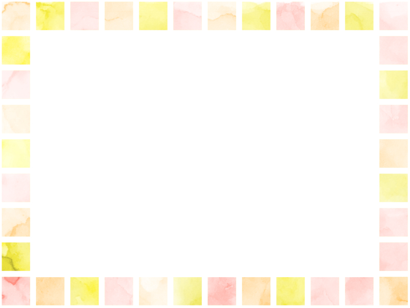

# マークダウンの練習

こんにちは世界

こんにちは
世界

こんにちは  
世界

こんにちは

世界

**こんにちは世界**

- レベル0
- レベル0
  - レベル1(半角スペース 1x2 = 2 個)
  - レベル1
    - レベル2 (半角スペース 2x2 = 4 個)
    - レベル2
  - レベル1
- レベル0

1. レベル0
1. レベル0
   1. レベル1
   1. レベル1
      1. レベル2
      1. レベル2
   1. レベル1
1. レベル0

ほげ[ふが](https://github.com/)ぴよ

[hoge](./hoge.md)

[fuga](./fuga/fuga.md)

